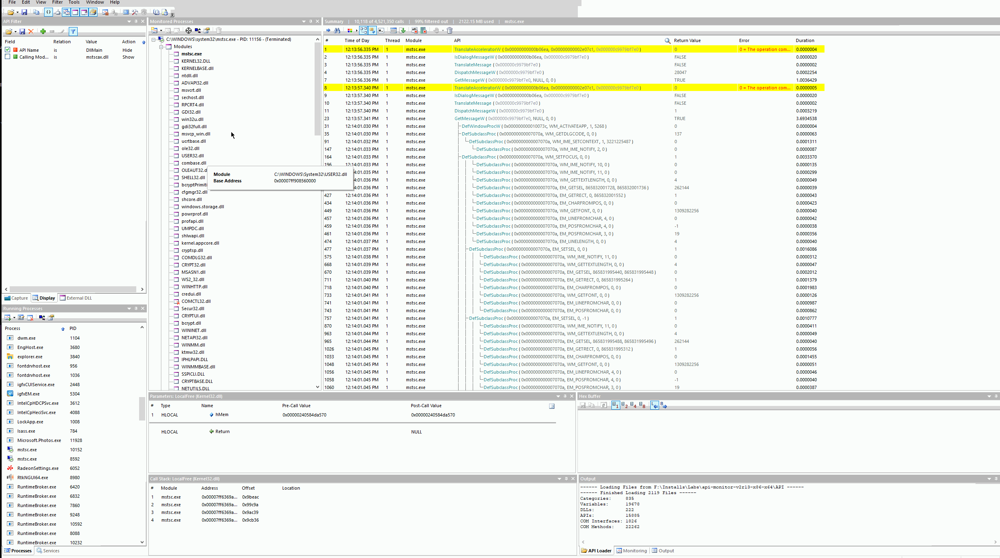
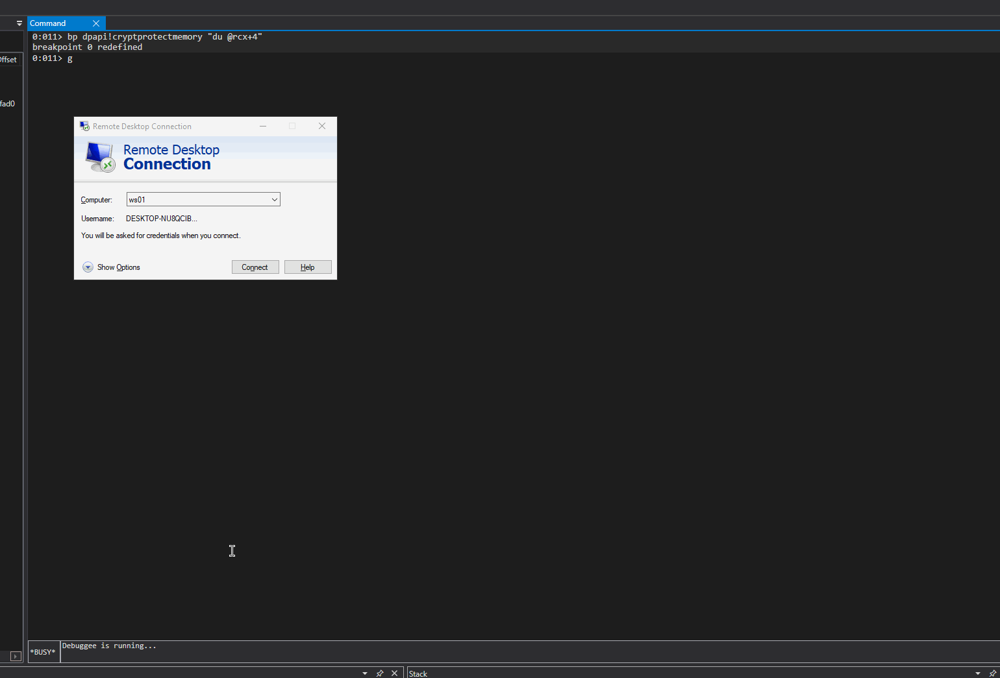
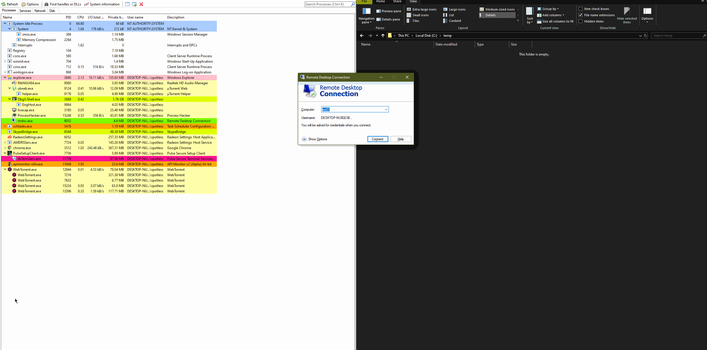

# API Monitoring and Hooking for Offensive Tooling

[Rio](https://twitter.com/0x09al) recently posted about his tool [RdpThief](https://www.mdsec.co.uk/2019/11/rdpthief-extracting-clear-text-credentials-from-remote-desktop-clients/) which I thought was plain genius. It allows for offensive operators to steal RDP credentials by injecting RdpThief's DLL into the RDP client mstc.exe.

Under the hood, RdpThief does the following:

* hooks mstc.exe functions responsible for dealing with user supplied credentials
* intercepts the user supplied username, password, hostname during authentication
* writes out intercepted credentials and hostname to a file

These are some notes of me tinkering with [API Monitor](http://www.rohitab.com/apimonitor), WinDBG and Detours \(Microsoft's library for hooking Windows APIs\) and reproducing some of the steps Rio took during his research and development of [RdpThief](https://github.com/0x09AL/RdpThief). 

These notes will serve me as a reference for future on how to identify and hook interesting functions that can be useful when writing offensive tooling.

## Walkthrough

If we launch mstc.exe and attempt connecting to a remote host WS01:


..we are prompted to enter credentials:


If API monitor was attached to mstc.exe when we tried to authenticate to the remote host WS01, we should now have a huge list of API calls invoked by mstsc.exe and its module logged.

### Intercepting Username

If we search for a string `spotless`, we will find some functions that take `spotless` as a string argument and one of those functions is `CredIsMarshaledCredentialW` as shown below: 




In WinDBG, if we put a breakpoint on `ADVAPI32!CredIsMarshaledCredentialW` and print out its first and only argument \(stored in RCX register per x64 calling convention\), we will see `DESKTOP-NU8QCIB\spotless` printed out:

```c
bp ADVAPI32!CredIsMarshaledCredentialW "du @rcx"
```


### Intercepting Hostname

To find the hostname of the RDP connection, we find API calls that took `ws01` \(our hostname\) as a string argument. Although RdpThief hooks `SSPICLI!SspiPrepareForCredRead` \(hostname supplied as a second argument\), another function that could be considered for hooking is `CredReadW` \(hostname a the first argument\) as seen below:


If we jump back to WinDBG and set another breakpoint for `CredReadW` and attempt to RDP to our host `ws01`, we get a hit:

```cpp
bp ADVAPI32!CredReadW "du @rcx"
```


Out of curiosity, let's also put a breakpoint on `SSPICLI!SspiPrepareForCredRead` and once it's hit, print out the second argument supplied to the function, which is stored in the RDX register:

```text
bp SSPICLI!SspiPrepareForCredRead
du @rdx
```


### Intercepting Password

We now know the functions required to hook for intercepting the username and the hostname. What's left is hooking the function that deals in one way or another with the password and from Rio's article, we know it's the DPAPI `CryptProtectMemory`. 

Weirdly, searching for my password in API Monitor resulted in no results although I could see it in plain text in `CryptUnprotectMemory`:


Reviewing `CryptProtectMemory` calls manually in API Monitor showed no plaintext password either, although there were multiple calls to the function and I would see the password already encrypted:



From the above screenshot, note the size of the encrypted blob is 32 bytes - we will come back to this in WinDBG


While having issues with API Monitor, let's put a breakpoint on `CryptProtectMemory` in WinDBG and print out a unicode string \(this should be the plaintext password passed to the function for encryption\) starting 4 bytes into the address \(first 4 bytes indicate the size of the encrypted data\) pointed by the RCX register:

```cpp
bp dpapi!cryptprotectmemory "du @rcx+4"
```

Below shows the plain text password on a second break:




Earlier, I noted the 32 bytes encrypted blob seen in `CryptProtectMemory` function call \(in API Monitor\) and also mentioned the 4 byte offset into RCX that holds the size of the encrypted blob - below shows that - first 4 bytes found at RCX \(during the `CryptProtectMemory` break\) are 0x20 or 32 in decimal:


## RdpThief in Action

Compiling RdpThief provides us with 2 DLLs for 32 and 64 bit architectures. Let's inject the 64 bit DLL into mstc.exe and attempt to RDP into `ws01` - we see the credentials getting intercepted and written to a file: 



## Intercepting Hostname via CredReadW

I wanted to confirm if my previous hypothesis about hooking `CredReadW` for intercepting the hostname was possible, so I made some quick changes to the RdpThief's project to test it. 

I commented out the `_SspiPrepareForCredRead` signature and hooked `CreadReadW` with a new function called `HookedCredReadW` which will pop a message box each time `CredReadW` is called and print its first argument as the message box text. 

Also, it will update the `lpServer` variable which is later written to the file creds.txt together with the username and password.

Below screenshot shows the code changes:


Of course, we need to register the new hook `HookedCredReadW` and unregister the old hook `_SspiPrepareForCredRead`:


Compiling and injecting the new RdpThief DLL confirms that the `CredReadW` can be used to intercept the the hostname:


## References













