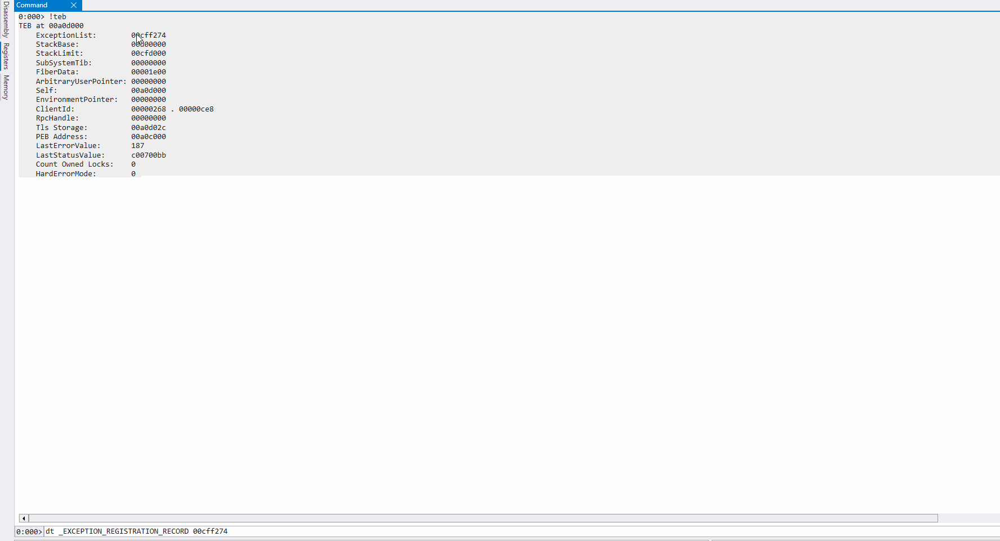

# SEH Based Buffer Overflow

The purpose of this lab is to familiarize how Structured Exception Handler / SEH based buffer overflow exploits work.

This lab is based on a blog post [The Basics of Exploit Development 2: SEH Overflows](https://www.coalfire.com/the-coalfire-blog/march-2020/the-basics-of-exploit-development-2-seh-overflows) by Andy Bowden.


WIP


## SEH 101

* Structured exception handling \(SEH\) is simply code in a program that is meant to handles such situations when the program throws some exception either due to a hardware or software issue and do something to resolve it;
* SEH code is located on the program's stack for each `try-catch` code block and each handler has its own stack frame;
* SEH is stored in stack as `EXCEPTION_REGISTRATION` structure \(also called as SEH record\) consisting of two 4 byte fields:
  * pointer to the next SEH record within the SEH chain;
  * pointer to the exception handler code - the `catch` part of the code block;
* A program may have multiple SEHs registered that are connected by a linked list, forming a SEH chain;
  * Once a program throws an exception, the OS runs through the SEH chain and attempts to find an apropriate exception handler;
  * If no suitable handler is found, a default OS handler is used from the bottom of the SEH chain. All SEH chains always end with a default Windows SEH record located at `FFFFFFFF`;
* SEH chain is stored in the Thread Environment Block \(TEB\) memory structure as the first member called Thread Information Block \(TIB\) and can be accessed via FS segment register `FS:[0x00]`;
* 64-bit applications are not vulnerable to SEH overflow as binaries are linked with safe exception handlers embedded in the PE file itself.
* 32-bit applications can be linked with `/SAFESEH` flag, which will produce a PE file with a table of safe exception handlers, assuming all modules are compatible with safe execption handling feature.

Below is a simplified diagram visualising some of the key points outlined above:


## Exploring TEB / TIB / SEH Chains

### Memory Structures

Let's explore the key structures around SEH using WinDBG and confirm the key points mentioned in the SEH 101 section.

Thread Environment Block is a described in the OS as `_TEB` memory structure and can be inspected in WinDBG like so: 

```text
dt _teb
```


As seen from the above screenshot, the TEB's first member is `_NT_TIB` \(Thread Information Block\) memory structure, which can be inspected like so:

```text
dt _NT_TIB
```


As mentioned earlier, the first member inside the `_NT_TIB` structure is a pointer to `_EXCEPTION_REGISTRATION_RECORD` memory structure, which is the first SEH record / head of the SEH Chain linked list and can be inspected like so:

```text
dt _EXCEPTION_REGISTRATION_RECORD
```


The first member of `_EXCEPTION_REGISTRATION_RECORD` is a pointer to the next SEH record and the second member is a pointer to the exception handler that is defined in the `_EXCEPTION_DISPOSITION` memory structure.

### Actual Memory Structures

We've looked at some of the key memory structures, but now let's see how those structures look like when inspecting a real program that has some SEH defined. 

As noted earlier, SEH are the `try` / `catch` code blocks in the program as shown below:

```c
int main(int argc, char* argv[]) 
{
    try
    {
        throw 1;
    }
    catch (int e)
    {
        
    }

    return 0;
}
```

Let's compile the above program and inspect it with WinDBG again with a `!teb` command:


We can see that `_TEB` is located at `00a25000` and that the ExceptionList / head of the SEH chain is located at `00cff2cc`. From earlier, we said this same value could be retrieved from the FS segment register `fs:[0]`, so let's confirm:

```text
dd fs:[0] L1
```

![SEH chain retrieved from fs:\[0\]](../../../.gitbook/assets/image%20%28971%29.png)

Let's check the start of the SEH chain at `00cff2cc` like so:

```text
dt _EXCEPTION_REGISTRATION_RECORD 00cff2cc
```

Below is a gif that demonstrates how we find the the head of the SEH chain and walk through all the registered SEH records in it, with the last one being located at `0xffffffff`:


In the below GIF the ExceptionList address changed from 00cff2cc to 00cff274 due to the restarted program.




## References






