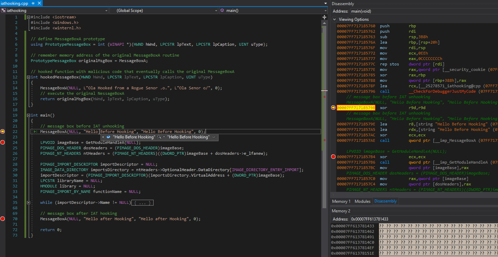

# Import Adress Table \(IAT\) Hooking

## Overview

* Windows portable executable contains a structure called `Import Address Table (IAT)` 
* IAT contains pointers to information that is critical for an executable to do its job: 
  * a list of modules names \(DLLs\) it depends on for additional functionality
  * a list of function names and their addresses that will be called by the binary at some point
* It is possible to hook function pointers specified in the IAT by overwriting the target function's address with a rogue function address

Below is a simplified diagram that attempts to visualize the flow of events before and after a function   
\(`MessageBoxA` in this example, but could be any\) is hooked:


**Before hooking**

1. the target program calls a WinAPI `MessageBoxA` function
2. the program looks up the `MessageBoxA` address in the IAT 
3. code execution jumps to the  `kernel32!MessageBoxA` address resolved in step 2 where legitimate code for displaying the `MessageBoxA` \(green box\) lives

**After hooking**

1. the target program calls `MessageBoxA` like the first time
2. the program looks up the `MessageBoxA` address in the IAT 
3. this time, because the IAT has been tampered with, the `MessageBoxA` address in the IAT is pointing to a rogue `hookedMessageBox` function \(red box\) 
4. the program jumps to the `hookedMessageBox` retrieved in step 3
5. the program intercepts the `MessageBoxA` parameters and executes some malicous code 
6. the program call transfers the execution back to the legitimate `kernel32!MessageBoxA` routine

## Walkthrough & Code

In this lab I'm going to write a simple executable that will hook its `MessageBoxA` by leveraging IAT hooking technique and redirect it to a new function `hookedMessageBox` as per above visualisation.


IAT hooking is usually performed by a DLL injected into a target process, but for the sake of simplicity and illustration, in this lab, the IAT hooking is implemented for the hosts process.


To hook the `MessageBoxA` we need to:

1. Save memory address of the original `MessageBoxA`
2. Define a `MessageBoxA` function prototype
3. Create a `hookedMessageBox` \(rogue `MessageBoxA`\) function with the above prototype. This is the function that intercepts the original `MessageBoxA` call, executes some malicious code and transfers code execution to the original `MessageBoxA` routine for which the address is retrieved in step 1
4. Parse IAT table until address of `MessageBoxA` is found
   1. More about PE parsing in [Parsing PE File Headers with C++](../../miscellaneous-reversing-forensics/pe-file-header-parser-in-c++.md)
   2. More about Import Address Table parsing in [Reflective DLL Injection](reflective-dll-injection.md#resolving-import-address-table)
5. Replace `MessageBoxA` address with address of the `hookedMessageBox`

Below is the code for all of the above steps:

```cpp
#include <iostream>
#include <Windows.h>
#include <winternl.h>

// define MessageBoxA prototype
using PrototypeMessageBox = int (WINAPI *)(HWND hWnd, LPCSTR lpText, LPCSTR lpCaption, UINT uType);

// remember memory address of the original MessageBoxA routine
PrototypeMessageBox originalMsgBox = MessageBoxA;

// hooked function with malicious code that eventually calls the original MessageBoxA
int hookedMessageBox(HWND hWnd, LPCSTR lpText, LPCSTR lpCaption, UINT uType)
{
	MessageBoxW(NULL, L"Ola Hooked from a Rogue Senor .o.", L"Ola Senor o/", 0);
	// execute the original NessageBoxA
	return originalMsgBox(hWnd, lpText, lpCaption, uType);
}

int main()
{
	// message box before IAT unhooking
	MessageBoxA(NULL, "Hello Before Hooking", "Hello Before Hooking", 0);
	
	LPVOID imageBase = GetModuleHandleA(NULL);
	PIMAGE_DOS_HEADER dosHeaders = (PIMAGE_DOS_HEADER)imageBase;
	PIMAGE_NT_HEADERS ntHeaders = (PIMAGE_NT_HEADERS)((DWORD_PTR)imageBase + dosHeaders->e_lfanew);

	PIMAGE_IMPORT_DESCRIPTOR importDescriptor = NULL;
	IMAGE_DATA_DIRECTORY importsDirectory = ntHeaders->OptionalHeader.DataDirectory[IMAGE_DIRECTORY_ENTRY_IMPORT];
	importDescriptor = (PIMAGE_IMPORT_DESCRIPTOR)(importsDirectory.VirtualAddress + (DWORD_PTR)imageBase);
	LPCSTR libraryName = NULL;
	HMODULE library = NULL;
	PIMAGE_IMPORT_BY_NAME functionName = NULL; 

	while (importDescriptor->Name != NULL)
	{
		libraryName = (LPCSTR)importDescriptor->Name + (DWORD_PTR)imageBase;
		library = LoadLibraryA(libraryName);

		if (library)
		{
			PIMAGE_THUNK_DATA originalFirstThunk = NULL, firstThunk = NULL;
			originalFirstThunk = (PIMAGE_THUNK_DATA)((DWORD_PTR)imageBase + importDescriptor->OriginalFirstThunk);
			firstThunk = (PIMAGE_THUNK_DATA)((DWORD_PTR)imageBase + importDescriptor->FirstThunk);

			while (originalFirstThunk->u1.AddressOfData != NULL)
			{
				functionName = (PIMAGE_IMPORT_BY_NAME)((DWORD_PTR)imageBase + originalFirstThunk->u1.AddressOfData);
					
				// find MessageBoxA address
				if (std::string(functionName->Name).compare("MessageBoxA") == 0)
				{
					SIZE_T bytesWritten = 0;
					DWORD oldProtect = 0;
					VirtualProtect((LPVOID)(&firstThunk->u1.Function), 8, PAGE_READWRITE, &oldProtect);
						
					// swap MessageBoxA address with address of hookedMessageBox
					firstThunk->u1.Function = (DWORD_PTR)hookedMessageBox;
				}
				++originalFirstThunk;
				++firstThunk;
			}
		}

		importDescriptor++;
	}

	// message box after IAT hooking
	MessageBoxA(NULL, "Hello after Hooking", "Hello after Hooking", 0);
	
	return 0;
}
```

## Demo

Before IAT manipulation, `MessageBoxA` points to `0x00007ffe78071d30`:


Our `hookedMessageBox` is located at `0x00007ff662195440`:


After the IAT manipulation, `MessageBoxA` now points to `hookedMessageBox`


Afer this, the `MessageBoxA` that should have printed `Hello after Hooking`, but we see that the message text is the text from `hookedMessageBox` routine, confirming that the IAT hook was successful and the rouge function was called first:


Below shows the entire flow of events:

1. `MessageBoxA` displays `Hello Before Hooking` before the hook is implemented
2. After the IAT hook for `MessageBoxA` is implemented,  once `MessageBoxA` is called, the program gets redirected to a `hookedMessageBox` function that displays `Ola Hooked from a Rogue Senor .o.` instead of the intended `Hello after Hooking`
3. Finally, `hookedMessageBox` calls the original `MessageBoxA` that prints out the intended `Hello after Hooking`



## References







