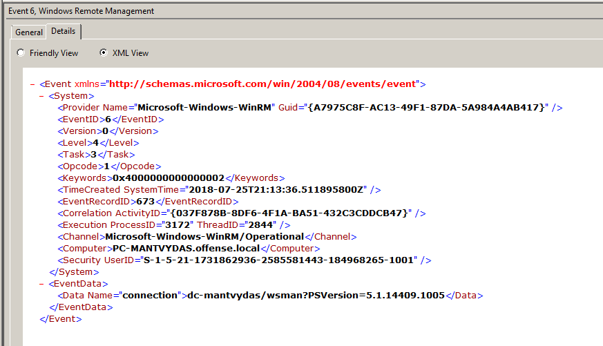

# T1028: WinRM for Lateral Movement

## Execution

Attacker establishing a PSRemoting session from a compromised system `10.0.0.2` to a domain controller `dc-mantvydas` at `10.0.0.6`:



```csharp
New-PSSession -ComputerName dc-mantvydas -Credential (Get-Credential)

  Id Name            ComputerName    ComputerType    State         ConfigurationName     Availability
 -- ----            ------------    ------------    -----         -----------------     ------------
  1 Session1        dc-mantvydas    RemoteMachine   Opened        Microsoft.PowerShell     Available

PS C:\Users\mantvydas> Enter-PSSession 1
[dc-mantvydas]: PS C:\Users\spotless\Documents> calc.exe
```



## Observations

Note the process ancestry:


On the host that initiated the connection, a `4648` logon attempt is logged, showing what process initiated it, the hostname where it connected to and which account was used:


The below graphic shows that the logon events `4648` annd `4624` are being logged on both the system that initiated the connection \(`pc-mantvydas - 4648`\) and the system that it logged on to \(`dc-mantvydas - 4624`\):


Additionally, `%SystemRoot%\System32\Winevt\Logs\Microsoft-Windows-WinRM%4Operational.evtx` on the host that initiated connection to the remote host, logs some interesting data for a task `WSMan Session initialize` :

```markup
- <Event xmlns="http://schemas.microsoft.com/win/2004/08/events/event">
- <System>
  <Provider Name="Microsoft-Windows-WinRM" Guid="{A7975C8F-AC13-49F1-87DA-5A984A4AB417}" /> 
  <EventID>6</EventID> 
  <Version>0</Version> 
  <Level>4</Level> 
  <Task>3</Task> 
  <Opcode>1</Opcode> 
  <Keywords>0x4000000000000002</Keywords> 

  # connection iniation time
  <TimeCreated SystemTime="2018-07-25T21:13:36.511895800Z" /> 
  <EventRecordID>673</EventRecordID> 

  # a unique connection ID
  <Correlation ActivityID="{037F878B-8DF6-4F1A-BA51-432C3CDDCB47}" /> 

  # process ID that initiated the connection
  <Execution ProcessID="3172" ThreadID="2844" /> 
  <Channel>Microsoft-Windows-WinRM/Operational</Channel> 
  <Computer>PC-MANTVYDAS.offense.local</Computer> 
  <Security UserID="S-1-5-21-1731862936-2585581443-184968265-1001" /> 
  </System>
- <EventData>

  # remote host the connection was initiated to
  <Data Name="connection">dc-mantvydas/wsman?PSVersion=5.1.14409.1005</Data> 
  </EventData>
  </Event>
```

...same as above just in the actual screenshot:




Since we entered into a PS Shell on the remote system `(Enter-PSSession)` , there is another interesting log showing the establishment of a remote shell - note that the ShellID corresponds to the earlier observed `Correlation ActivityID`:


## References





