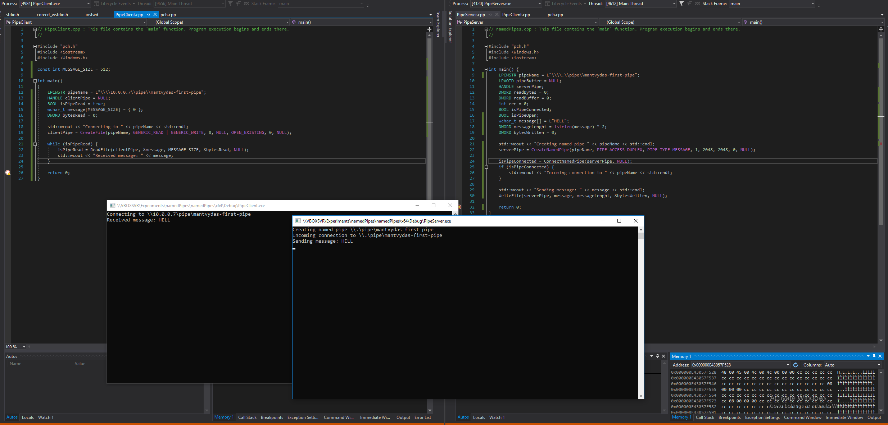

# Windows NamedPipes 101

## Overview

A `pipe` is a block of shared memory that processes can use for communication and data exchange.

`Named Pipes` is a Windows mechanism that enables two unrelated processes to exchange data between themselves, even if the processes are located on two different networks. It's very simar to client/server architecture as notions such as `a named pipe server` and a named `pipe client` exist.

A named pipe server can open a named pipe with some predefined name and then a named pipe client can connect to that pipe via the known name. Once the connection is established, data exchange can begin.

## References



